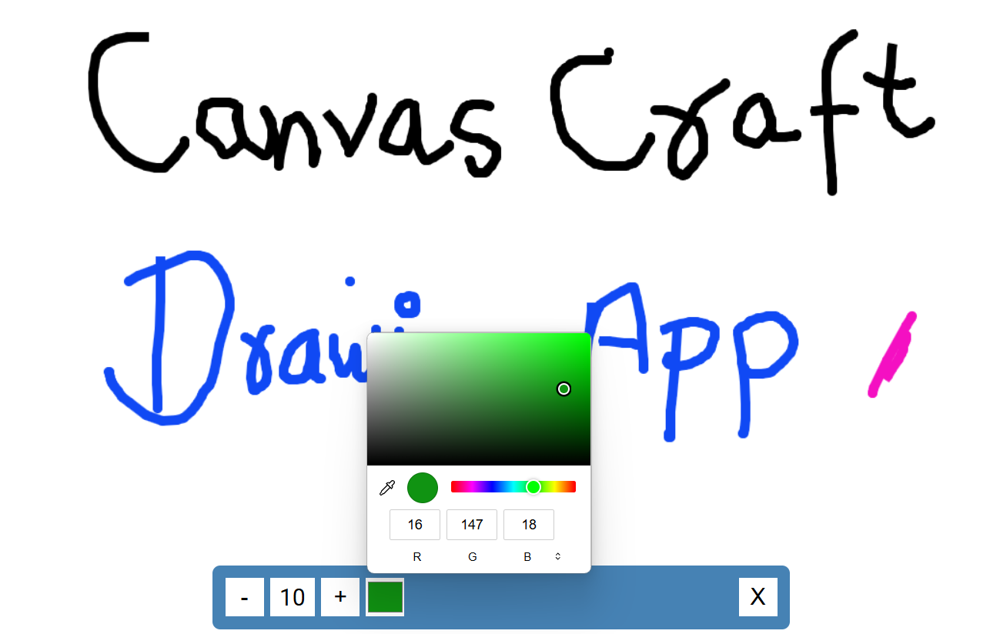

# CanvasCraft

A simple and interactive drawing application that allows users to draw on a canvas with various tools for changing brush size, color, and clearing the canvas. This application is perfect for quick sketches, doodles, or practicing digital art skills.



## Features

- **Resizable Canvas**: The canvas automatically adjusts to the size of the window.
- **Brush Size Control**: Increase or decrease the brush size.
- **Color Picker**: Choose different colors for the brush.
- **Clear Canvas**: Clear the entire canvas with a single click.
- **Smooth Drawing**: Draw lines and circles smoothly on the canvas.

## Demo

You can see the application in action with the following demo link: [Demo Link](https://mkraj-7838.github.io/CanvasCraft/)

## Installation

To get a local copy up and running, follow these simple steps:

1. **Clone the repo**
    ```sh
    git clone https://github.com/your-username/CanvasCraft.git
    ```

2. **Navigate to the project directory**
    ```sh
    cd CanvasCraft
    ```

3. **Open `index.html` in your browser**

## Usage

1. Open the `index.html` file in your preferred web browser.
2. Use the canvas to draw by clicking and dragging your mouse.
3. Use the increase and decrease buttons to adjust the brush size.
4. Select a color using the color picker.
5. Click the clear button to clear the canvas.
